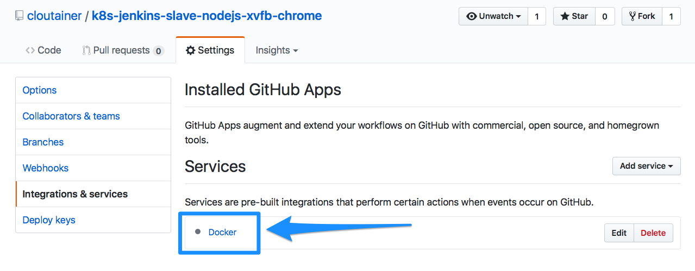

# documentation

### Dockerhub Builds

Dockerhub account `cloutainer` is linked to GitHub Account `cloutainer-ci`.
We use automated Builds in Dockerhub.

We ONLY BUILD TAGS. We do not build master. We do not provide `latest` tag.

**Tag Build Settings**

Each automated build has the following tag build setting: `/^v[0-9.]+$/`:

**GitHub Repo Settings**

Each Repo needs to have a Docker integration

-----
&nbsp;

### License

[MIT](https://github.com/cloutainer/k8s-jenkins-slave-nodejs-xvfb-chrome/blob/master/LICENSE) © [Bernhard Grünewaldt](https://github.com/clouless)
